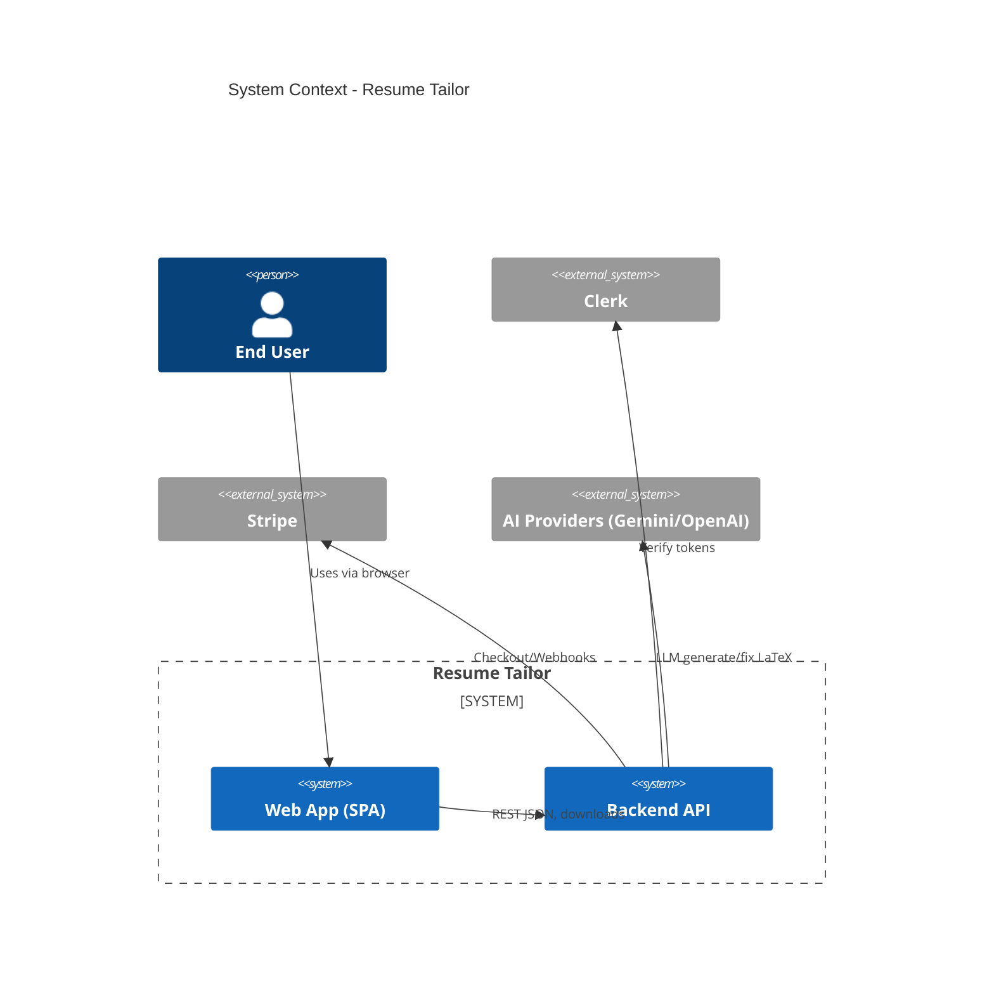
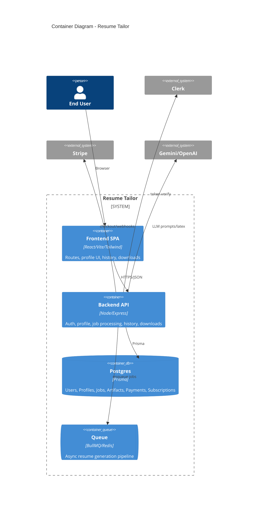

### Overview

Resume Tailor is a full-stack platform to generate tailored resumes from a user profile and a job description. Users authenticate via Clerk, manage their profile, paste job descriptions, and trigger AI-powered generation. The backend orchestrates AI (Gemini/OpenAI), LaTeX compilation to PDF, and persists artifacts in Postgres via Prisma. Users can view “Generation History” and download PDFs.

### Component map

- **Frontend (Vite + React + Tailwind)**: SPA with routes for Dashboard/Generate/History/Profile/Billing. Uses Clerk for auth, fetches data from server APIs, renders history and download links.
- **Backend (Express)**: Auth (Clerk or JWT), REST APIs for profile, job processing, history, downloads, Stripe billing, health. Uses Prisma to Postgres.
- **Workers/Queues**: In-process async job pipeline; queue utilities exist in `server/lib/queue.js` and job processor in `server/lib/job-processor.js` for robust async processing.
- **Database (Postgres)**: Prisma models for `User`, `Profile`, `Job`, `Artifact`, `Embedding`, `Subscription`, `UsageTracking`, `Payment`.
- **AI Providers**: Gemini (primary) with OpenAI fallback; custom prompt builders; LaTeX compilation to PDF artifacts.
- **3rd-party**: Clerk (auth), Stripe (billing), Redis (queue), PDF/Prisma toolchain.

### Repo file tree (depth 3)

```
/ (root)
  package.json, docker-compose.yml, Dockerfile, railway.json
  frontend/
    package.json, vite.config.ts, tailwind.config.js, Dockerfile
    src/
      App.tsx, main.tsx, index.css
      pages/ (DashboardModern.tsx, History.tsx, FindJob.tsx, ...)
      components/ (JobCard.tsx, JobDetailPanel.tsx, ...)
      layouts/ (ModernLayout.tsx, ProtectedRoute.tsx, ...)
      utils/ (htmlCleaner.ts, ...)
  server/
    package.json, server.js, prisma/schema.prisma, nixpacks.toml
    routes/ (jobs.js, ai-search.js, ...)
    lib/ (ai-resume-generator.js, latex-compiler.js, queue.js, ...)
    prisma/migrations/
  extension/
    manifest.json, background/service-worker.js, content/*.js
```

### C4: System Context



### C4: Containers



### Data model summary

- `User(id, email, password, clerkId?, createdAt)`
- `Profile(id, userId [unique], data Json, updatedAt)` – stores structured profile including `resumeText`, experiences, skills.
- `Job(id cuid, userId, status, resumeText, jobDescription, aiMode, company?, role?, jobUrl?, createdAt, completedAt, diagnostics Json)`
- `Artifact(id cuid, jobId, type enum, version, content Bytes, metadata Json?, createdAt)` – stores PDF/LATEX/JSON artifacts.
- `Embedding(id cuid, jobId, content, contentType enum, embedding Float[], relevance, createdAt)`
- `Subscription(id cuid, userId [unique], stripe ids, tier enum, status enum)`
- `UsageTracking(id cuid, userId, date, resumesGenerated, dailyLimit, tier, resetAt)`
- `Payment(id cuid, userId, stripePaymentId, amount, currency, status enum, createdAt)`

References:

```1:75:/Users/vinaymuthareddy/RESUME_GENERATOR/server/prisma/schema.prisma
generator client {
  provider = "prisma-client-js"
}
```

```60:111:/Users/vinaymuthareddy/RESUME_GENERATOR/server/prisma/schema.prisma
model Artifact {
  id        String       @id @default(cuid())
  jobId     String
  type      ArtifactType
  version   Int          @default(1)
  content   Bytes
  metadata  Json?
  schema    Json?
  validated Boolean      @default(false)
  createdAt DateTime     @default(now())
  job       Job          @relation(fields: [jobId], references: [id], onDelete: Cascade)
}
```

### Build/deploy summary

- Frontend: Vite + React 18, Tailwind v4. Commands: `npm run dev`, `npm run build`, `npm start` (serve static). Proxy to backend at 3000.

```1:36:/Users/vinaymuthareddy/RESUME_GENERATOR/frontend/vite.config.ts
import { defineConfig } from 'vite';
```

```1:42:/Users/vinaymuthareddy/RESUME_GENERATOR/frontend/package.json
{
  "name": "resume-tailor-frontend",
  "scripts": {"dev": "vite", "build": "...", "start": "npx serve ..."}
}
```

- Backend: Node/Express, Prisma to Postgres. Start via `node server.js`; ports via config (`config.server.port`).

```2702:2706:/Users/vinaymuthareddy/RESUME_GENERATOR/server/server.js
const PORT = config.server.port;
const server = app.listen(PORT, () => {
  console.log(`✅ Server running on port ${PORT}`);
});
```

- Infra: Dockerfiles in root and frontend; Railway configs present. Redis/queues included; Stripe webhooks configured.
- CI/CD: Not present in repo; Railway/Nixpacks configs for deploy.

Environments and env vars: `JWT_SECRET`, `OPENAI_API_KEY`, `DATABASE_URL`, `CLERK_SECRET_KEY`, Stripe keys, `PUBLIC_BASE_URL`. Validation:

```127:145:/Users/vinaymuthareddy/RESUME_GENERATOR/server/server.js
function validateEnvironment() {
  const required = ['JWT_SECRET', 'OPENAI_API_KEY', 'DATABASE_URL'];
  ...
}
```
