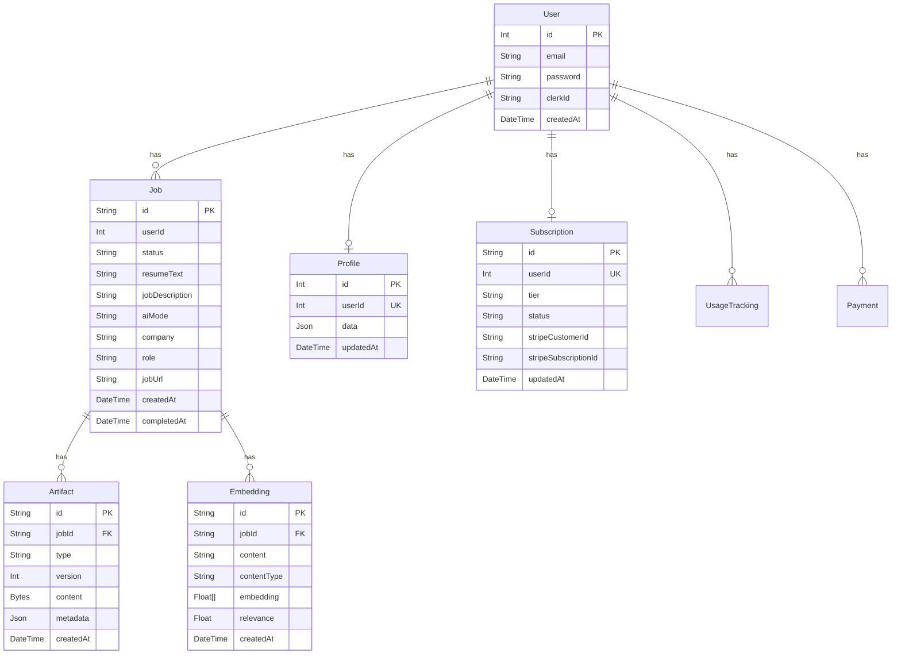

### ERD



### Table notes (source)

```1:179:/Users/vinaymuthareddy/RESUME_GENERATOR/server/prisma/schema.prisma
datasource db { provider = "postgresql" }
```

### Generation history storage and queries

- Records live in `Job` with `status`, `createdAt`, plus related `Artifact` for PDFs.
- Listing endpoint queries:

```1406:1449:/Users/vinaymuthareddy/RESUME_GENERATOR/server/server.js
const jobs = await prisma.job.findMany({ where:{ userId: req.userId }, orderBy:{ createdAt:'desc' }, ... })
```

- Resumes endpoint returns latest PDF artifact per job:

```1605:1647:/Users/vinaymuthareddy/RESUME_GENERATOR/server/server.js
include: { artifacts: { where:{ type:'PDF_OUTPUT' }, orderBy:{ version:'desc' }, take:1 } }
```

- Download endpoints stream `Artifact.content` by job id or filename:

```2537:2606:/Users/vinaymuthareddy/RESUME_GENERATOR/server/server.js
app.get('/api/resumes/:identifier', ...)
```
