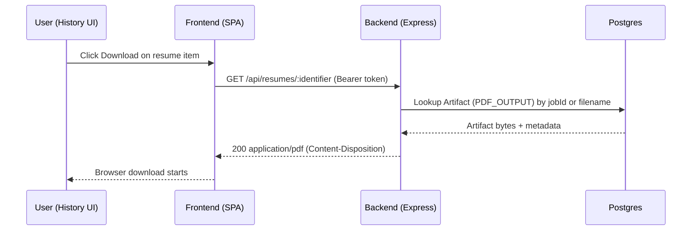

### Local setup

1. Prereqs: Node 18+, PNPM/NPM, Postgres, Redis (for queues), LaTeX toolchain (if compiling PDFs locally), Stripe test keys.
2. Env: create `.env` in `server/` with at least:
   - `JWT_SECRET`, `OPENAI_API_KEY`, `DATABASE_URL`, `PUBLIC_BASE_URL`
   - Optionally: `CLERK_SECRET_KEY`, `STRIPE_SECRET_KEY`, `STRIPE_WEBHOOK_SECRET`, price IDs.
3. Install deps:
   - Frontend: `cd frontend && npm i`
   - Backend: `cd server && npm i && npm run prisma:generate && npm run prisma:migrate`
4. Run backend: `npm run start` (port from config, typically 3000)
5. Run frontend: `npm run dev` (Vite at 5173, proxies /api to 3000)

### Seed/data

- Create a user via `/api/register` or sign-in with Clerk.
- Create/update profile via UI or `/api/profile`.

### Example env keys (redacted)

- `JWT_SECRET=...`
- `OPENAI_API_KEY=sk-...`
- `DATABASE_URL=postgres://...`
- `PUBLIC_BASE_URL=http://localhost:5173`

### Common failures and diagnosis

- Server fails on boot due to missing envs:

```127:145:/Users/vinaymuthareddy/RESUME_GENERATOR/server/server.js
validateEnvironment(); // exits if JWT_SECRET/OPENAI_API_KEY/DATABASE_URL missing
```

- Clerk token errors → ensure frontend key and `CLERK_SECRET_KEY` present.

```73:85:/Users/vinaymuthareddy/RESUME_GENERATOR/server/server.js
createClerkClient(...)
```

- PDF download 404 → ensure `Artifact` exists for job and belongs to user.

```2615:2660:/Users/vinaymuthareddy/RESUME_GENERATOR/server/server.js
GET /api/job/:jobId/download/pdf
```

- Rate limits on generation:

```113:126:/Users/vinaymuthareddy/RESUME_GENERATOR/server/server.js
jobProcessingLimiter
```

- Health checks:

```241:254:/Users/vinaymuthareddy/RESUME_GENERATOR/server/server.js
GET /health
```

```279:293:/Users/vinaymuthareddy/RESUME_GENERATOR/server/server.js
GET /health/db
```

### Sequence: User clicks Download in History


